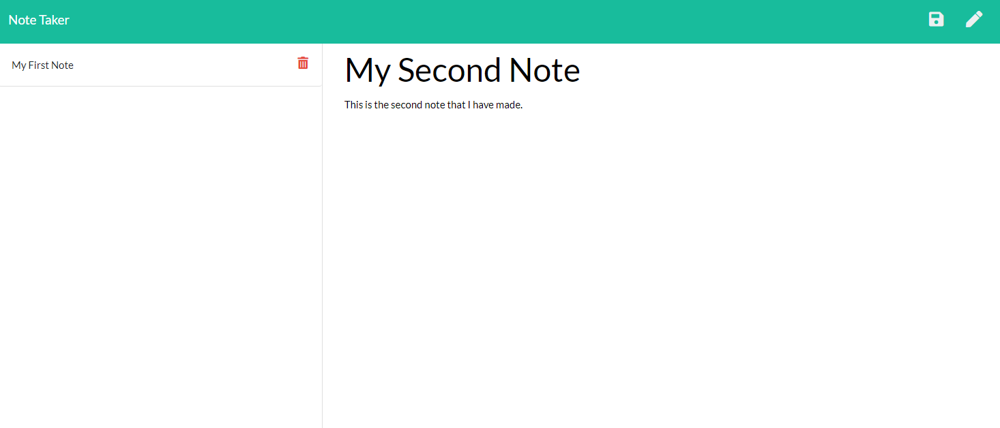

# Note-Taker

This is a simple note taking application. When you click the get started button on the home screen it will take you to a page to take notes on. You will enter a title for the note, then below you can type in your notes. Once done you will click the save icon on the top right side of the page and that note will be placed on the left side of the page. On the left side you will see the different notes you have made and can click on each to view the note. You can also delete any note by click the trash icon to delete it. 

Here is a link to the deployed page:
[Click Here For Link](https://whispering-hamlet-82762.herokuapp.com/)

